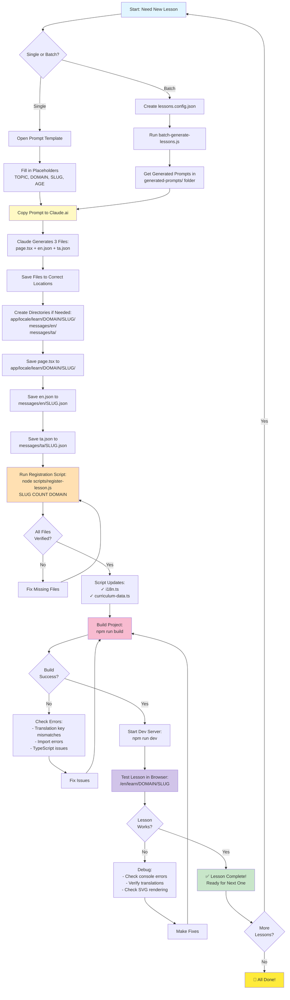

## Workflow Steps

### Phase 1: Generation (5 min)
1. Choose single or batch
2. Fill prompt template OR create config
3. Generate prompts (if batch)
4. Paste into Claude.ai
5. Get 3 generated files

### Phase 2: Setup (2 min)
6. Create necessary directories
7. Save page.tsx to lesson folder
8. Save en.json to messages/en/
9. Save ta.json to messages/ta/

### Phase 3: Registration (1 min)
10. Run register-lesson.js script
11. Script verifies all files exist
12. Script updates i18n.ts and curriculum-data.ts

### Phase 4: Testing (2 min)
13. Build project
14. Fix any build errors if needed
15. Start dev server
16. Test lesson in browser
17. Verify functionality

### Total Time: ~10 minutes per lesson

## Quick Commands

```bash
# Single Lesson
cat scripts/example-data-graphs-prompt.txt  # Get prompt
# → Paste to Claude → Save files
node scripts/register-lesson.js data-graphs 5 foundations
npm run build && npm run dev

# Batch Lessons  
node scripts/batch-generate-lessons.js lessons.config.json
# → For each prompt in generated-prompts/: Claude → Save → Register
npm run build && npm run dev
```

## Automation Benefits

- ⏱️ **Time**: 2-3 hours → 10 minutes
- ✅ **Quality**: Consistent structure across all lessons
- 🔄 **Repeatability**: Same workflow every time
- 🛡️ **Safety**: Automated verification of files
- 📚 **Scale**: Can generate 10+ lessons in an hour
